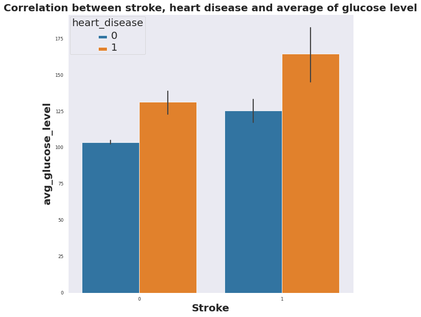
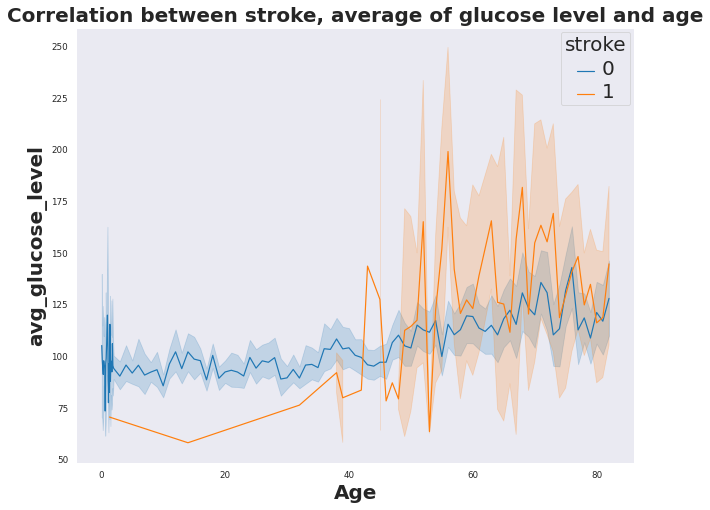
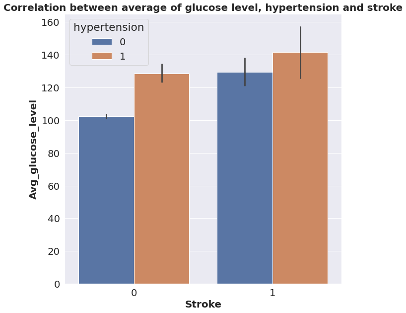

# Stroke Prediction 
#### Author: Milene Carmes Vallejo

### Data:

According to the World Health Organization (WHO) stroke is the 2nd leading cause of death globally, responsible for approximately 11% of total deaths. This dataset is used to predict whether a patient is likely to get stroke based on the input parameters like gender, age, various diseases, and smoking status. Each row in the data provides relavant information about the patient.

### Methods

#### Exploratory Visual and Analysis: 

- The original dataframe was divied in 2: pacients who had stroke and patients who didn't. 
- Boxplot, barplot, lineplot and histplot were created to find correlation between stroke and others features. 

#### Machine Learning part: 
- Dropping unnecessary columns.
- Data preparation: check duplicates, check inconsistencies values, check dtype of all columns. 
- Train/Test split: "stroke" column as target.
- Make selector columns because there are numbers and objects columns in this dataset.
- Ckeck missing values: There are missing values in numeric column bmi that is float number and was used SimpleImputer with ‘mean’ strategy.
- I used OHE for categorical columns and scaler for numeric columns since in machine learning the dataset needs to be all numeric and in the same scale. 
- I made a numeric_pipe with scaler and SimpleImputer. 
- I used make_column_transform to put all together (numeric and categorical). 
- Stroke column is unbalaced so I will use SMOTE to oversampling my data.
- I used 4 Models :  logistic regression, Decision Tree Classifier, Randon Forest and XGBClassifier. 
- I tunned and/or used PCA and some features engineering. 
- Evaluated the performance with classification_report and ConfusionMatrixDisplay.
- I was looking for a model with lower false negative rate that means with higher recall. 
 

### Results

Patients who have high level of glucose had stroke (1) and have heart disease(1).

Patients who had stroke (1) are older than 40 years old and have higher glucose level than patients who didn't have stroke (0). 

Patients who have higer levels of glucose have hypertension and had stroke.

### Model
The best model tested was Logistic Regression after we change the original dataframe with some feature engineering. 

#### The most important metrics

Since this prediction is to diagnose stroke the better model is that with lower False negative rate and better recall. With logistic regression in the test data the accuracy was 75%, recall 82% and false negative rate was 17%.  Definitely was the better model: 

### Recommendations:
Patient older than 40 years olde, with high glucose level or/and hypertension or/and heart disease have more proprability to have stroke. So is better search for stroke symptoms and start early treatment.  

### Limitations & Next Steps
The better model has 17% of false negative rate and 75% of accuracy. They are not perfect number maybe is because the dataset is unbalaced  about 95% of pacients didn't have stroke and 5% had.

### For further information
For any additional questions, please contact milene.c.vallejo@gmail.com
