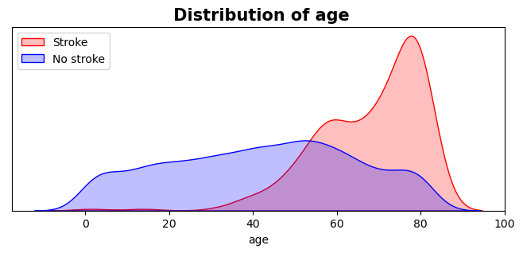
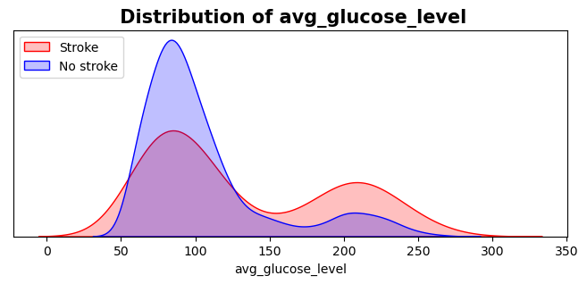
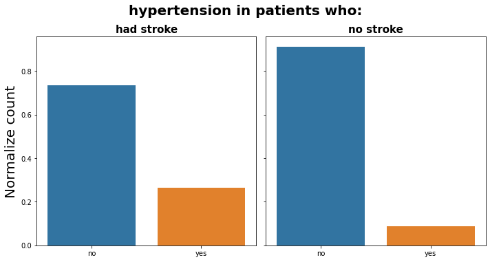
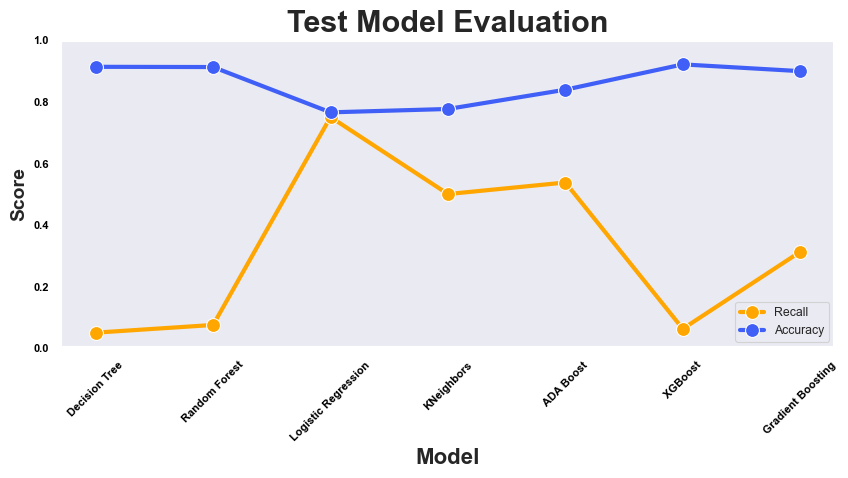
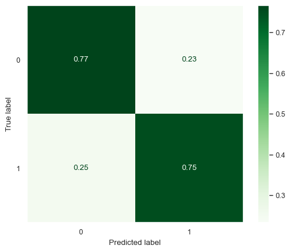
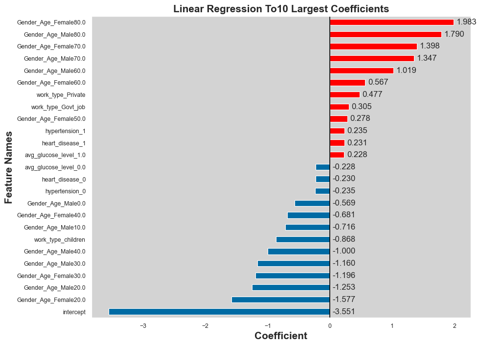
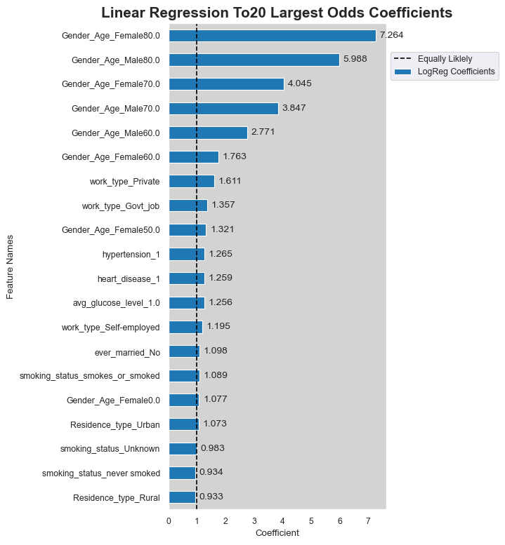

# Stroke Prediction 
#### Author: Milene Carmes Vallejo

### Data:

According to the World Health Organization (WHO), stroke is the second leading cause of death globally, responsible for approximately 11% of total deaths. This dataset is used to predict whether a patient is likely to get a stroke based on the input parameters like gender, age, various diseases, and smoking status. Each row in the data provides relevant information about the patient.

### Methods

#### Exploratory Visual and Analysis: 

- The original dataframe was divided into 2: patients who had stroke and patients who didn't. 
- Boxplot, barplot, lineplot and histplot were created to find a correlation between stroke and other features. 

#### Machine Learning part: 
- Dropping unnecessary columns.
- Data preparation: check duplicates, check inconsistencies values, check the type of all columns. 
- Train/Test split: "stroke" column as the target.
- Make selector columns because there are numbers and objects columns in this dataset.
- Check missing values: There are missing values in the numeric column BMI which is float number and was used SimpleImputer with ‘mean strategy'.
- Used OHE for categorical columns and scaler for numeric columns since in machine learning the dataset needs to be all numeric and in the same scale. 
- Made a numeric_pipe with scaler and SimpleImputer. 
- Used make_column_transform to put all together (numeric and categorical). 
- The stroke column is unbalanced so I will use SMOTE to oversample my data.
- Used 4 Models:  logistic regression, Decision Tree Classifier, Randon Forest, and XGBClassifier. 
- Tunned and/or used PCA and some features engineering. 
- Evaluated the performance with classification_report and ConfusionMatrixDisplay.
- I was looking for a model with a lower false negative rate which means with higher recall. 
- With the best model extract coefficients and interpreting odds coefficients
 

### Results

Patients who had a stroke (1) are older than 40 years old and have higher glucose levels than patients who didn't have a stroke (0). 

Stroke increases slightly with increased glucose

Patients who had stroke about 20% have heart disease and patients who didn’t have stroke less than 5% have heart disease. 

Patients who had stroke about 25% have hypertension and patients who  didn’t have stroke less than 10 % have hypertension. 

### Models
The best model tested was Logistic Regression after we change the original dataframe with some feature engineering. 

#### The most important metrics

Since this prediction is to diagnose stroke the better model is one with a lower False negative rate and better recall. With logistic regression in the test data, the accuracy was 77%, recall 75% and the false negative rate was 25%. 

## Best model - Logistic Regression

### Extracting Coefficients from LogisticRegression

Positive values indicate the feature makes it more likely the patient will have a stroke (old ages, work_type_Private and Gov_job, hypertension, heart disease and high glucose levels)

Negative values indicate the feature makes it less likely the patient will have a stroke.

### Convert the log-odds into odds

Interpreting Odds Coefficients
Females 80 and 70 years old are 7.2 and 4.0 times more likely to have a stroke respectively

Males 80 and 70 years old are 5.9 and 3.8 times more likely to have a stroke respectively

### Recommendations:
Patients older than 40 years old, with high glucose levels or/and hypertension or/and heart disease have higher risk to have a stroke. So is better to monitor for stroke symptoms and seek help in case of any symptom.

  
### For further information
For any additional questions, please contact milene.c.vallejo@gmail.com
