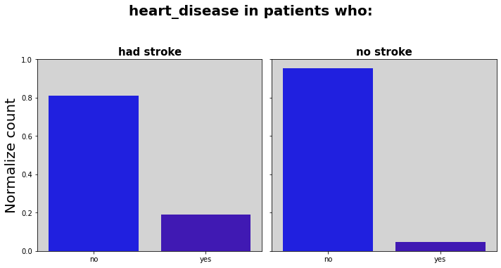
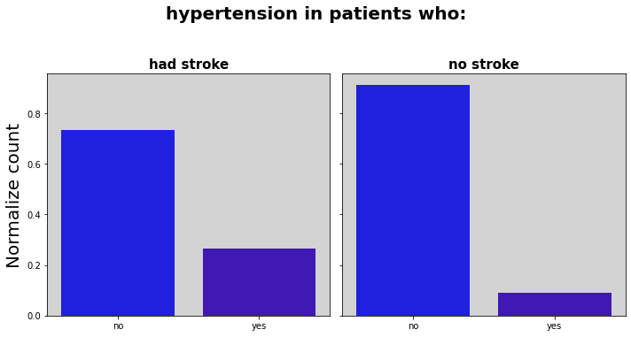

# Stroke Prediction 
#### Author: Milene Carmes Vallejo

### Data:

According to the World Health Organization (WHO), stroke is the second leading cause of death globally, responsible for approximately 11% of total deaths. This dataset is used to predict whether a patient is likely to get a stroke based on input parameters such as gender, age, various diseases, and smoking status. Each row in the dataset provides relevant information about a patient.

### Methods

#### Exploratory Visual and Analysis: 

- The original dataframe was divided into two groups: patients who had stroke and those who did not. 
- Boxplot, barplot, lineplot and histplot were created to examine correlation between stroke and other features. 

#### Machine Learning part: 
- Unnecessary columns were dropped.
- Data preparation included checking for duplicates, inconsistent values, and verifying column data types. 
- The dataset was split into training and testing sets, with the "stroke" column as the target variable.
- A column selector was created to handle both numerical and categorical columns.
- Missing values were found in the numerical column "BMI" (a float), and were imputed using the SimpleImputer with the 'mean' strategy.
- One-hot encoding (OHE) was applied to categorical columns, and scaling was performed on numerical columns to ensure the dataset was entirely numeric and standardized.
- A numeric_pipe was created using a scaler and SimpleImputer. 
- Used make_column_transform to to combine both numeric and categorical features.
- The stroke column was unbalanced so SMOTE was applied to oversample the data.
- Four models were used: Logistic Regression, Decision Tree Classifier, Random Forest, and XGBClassifier.
- Hyperparameter tuning and/or PCA, along with feature engineering, were applied.
- Evaluated the performance with classification_report and ConfusionMatrixDisplay.
- The goal was to find a model with a lower false negative rate, meaning a higher recall.
- With the best model, coefficients were extracted and interpreted odds coefficients
 
 
 ### Heatmap
 
 
 
  Stroke shows a stronger correlation with age (0.25) and mild correlation with hypertension, heart_disease and avg_glucose_level.
 

### Results

Patients who experienced a stroke (1) are typically older than 40 years and have higher glucose levels compared to those who did not experience a stroke (0).

Stroke increases slightly with increased glucose

Approximately 20% of patients who had a stroke also have heart disease, while less than 5% of patients who did not have a stroke have heart disease.

Approximately 25% of patients who had a stroke have hypertension, while less than 10% of patients who did not have a stroke have hypertension.

### Models
The best model tested was Logistic Regression after we change the original dataframe with some feature engineering. 

#### The most important metrics

Since this prediction is to diagnose stroke the better model is one with a lower False negative rate and higher recall. Using logistic regression in the test data, the accuracy was 77%, recall 75% and the false negative rate was 25%. 

## Best model - Logistic Regression

### Extracting Coefficients from LogisticRegression

Positive values indicate that the feature increases the likelihood of the patient having a stroke (e.g., older age, private or government job, hypertension, heart disease, and high glucose levels).

Negative values indicate that the feature decreases the likelihood of the patient having a stroke.

### Convert the log-odds into odds

Interpreting Odds Coefficients
Females 80 and 70 years old are 7.2 and 4.0 times more likely to have a stroke, respectively

Males 80 and 70 years old are 5.9 and 3.8 times more likely to have a stroke, respectively

### Recommendations:
Patients older than 40 years old, with high glucose levels or/and hypertension or/and heart disease have higher risk to have a stroke. It is advisable for these individuals to be regularly monitored for stroke symptoms and to seek medical help if any symptoms occur.

  
### For further information
For any additional questions, please contact milene.c.vallejo@gmail.com

# Tableau Dashboard

[https://public.tableau.com/shared/4FGDD44JB?:display_count=n&:origin=viz_share_link](https://public.tableau.com/app/profile/milene.carmes.vallejo7059/viz/stroke_project/filter_all_disease_simple)

 

